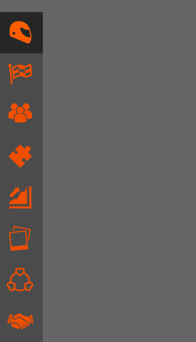

# animations-menu
Création d'une side bar animée.

## Cadre:
Cet exercice est effectué dans le cadre de ma deuxième semaine de formation au centre de formation BECODE. 
Nous sommes en janvier 2021.

## Technos utilisées:
HTML5
CSS3

## Auteurs: 
Juste moi :)

## Instructions:
Il faut créer une barre de menu avec un effet.
Délai: 1/2 jour

## Mission:

## Statut:
Non terminé

## Projet déployé: 
Lien Github : https://github.com/RekhaLambotte/animations-menu.git

Lien web: https://rekhalambotte.github.io/animations-menu/. 

## Remarques:
Projet très amusant. 
Malheureusement le délai était trop court pour moi.
je n'ai pas encore trouvé comment faire l' animation.